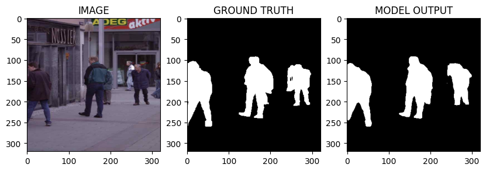
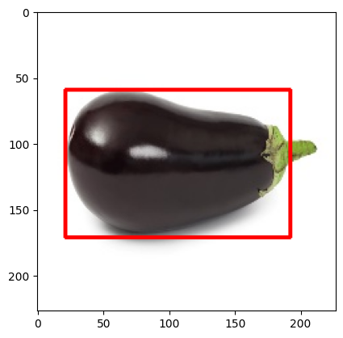
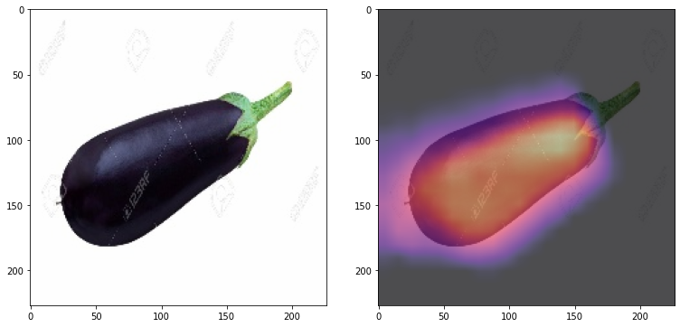
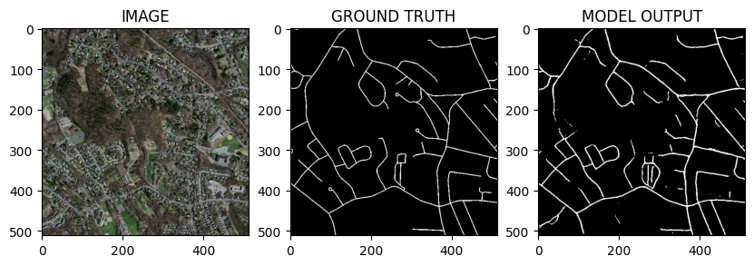
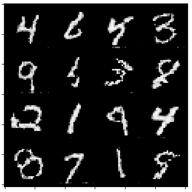

# mLproject
> Some deep learning projects using PyTorch.  

  

## Projects

- **Image segmentation** : detecting and delineating each distinct object of interest appearing in an image. The [dataset](https://github.com/VikramShenoy97/Human-Segmentation-Dataset) used contains images of humans in different environments and their corresponding masks. The masks can be thought of as the outline of the humans/objects in the image and helps to identify their positions in the image separating them from the background.

  

- **Object Localization** : task of locating an instance of a particular object category in an image, typically by specifying a tightly cropped bounding box centered on the instance. The [dataset](https://www.kaggle.com/datasets/mbkinaci/image-localization-dataset) used contains images of objects from 3 categories : mushroom, cucumber and eggplant.

  

- **[GradCAM](https://arxiv.org/abs/1610.02391)** : Gradient-weighted Class Activation Mapping _(Grad-CAM)_, uses the class-specific gradient information flowing into the final convolutional layer of a CNN to produce a coarse localization map of the important regions in the image. In this project, we train a classifier on the [dataset](https://www.kaggle.com/datasets/mbkinaci/image-localization-dataset) of objects from 3 categories : mushroom, cucumber and eggplant. To better understand the model's predictions, we implement a GradCAM function which returns the heatmap of localization map of a given class.

  

- **Aerial Image segmentation** : in remote sensing analysis, automatic extraction of road network from satellite or aerial images can be a most needed approach for efficient road database creation, refinement, and updating. Given an aerial image, it is required to output a binary mask for the input image showing for each pixel if it belongs to a road or not. We use a subset of the [Massachusetts Roads Dataset](https://www.cs.toronto.edu/~vmnih/data/) which contains aerial images of the state of Massachusetts and their corresponding masks. 

  

- **Generative adversarial network** : Generative Adversarial Networks (*GANs*) are a clever way of training a *generative* model by framing the problem as a supervised learning problem with two sub-models: the generator model that we train to generate new examples, and the discriminator model that tries to classify examples as either ***real*** (from the domain) or ***fake*** (generated). The two models are trained together in a zero-sum game, adversarial, until the discriminator model is fooled about half the time, meaning the generator model is generating plausible examples.[^1]

  

 <i>Generation of hand-written digits like the MNIST dataset.</i>

[^1]: [A Gentle Introduction to Generative Adversarial Networks (GANs) by Jason Brownlee.](https://machinelearningmastery.com/what-are-generative-adversarial-networks-gans/)
